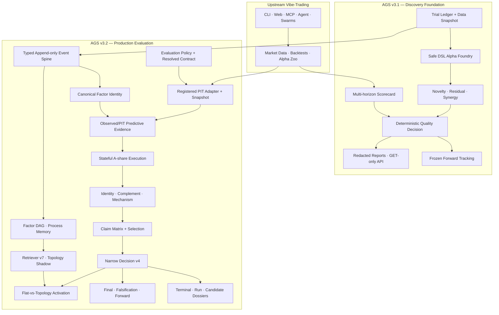
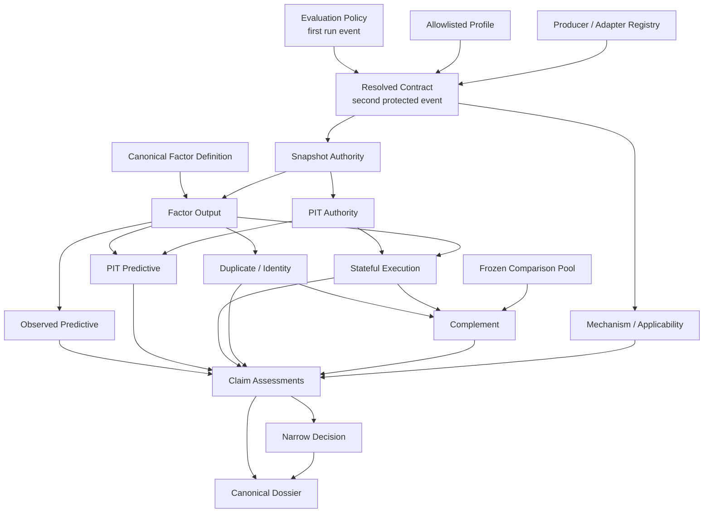
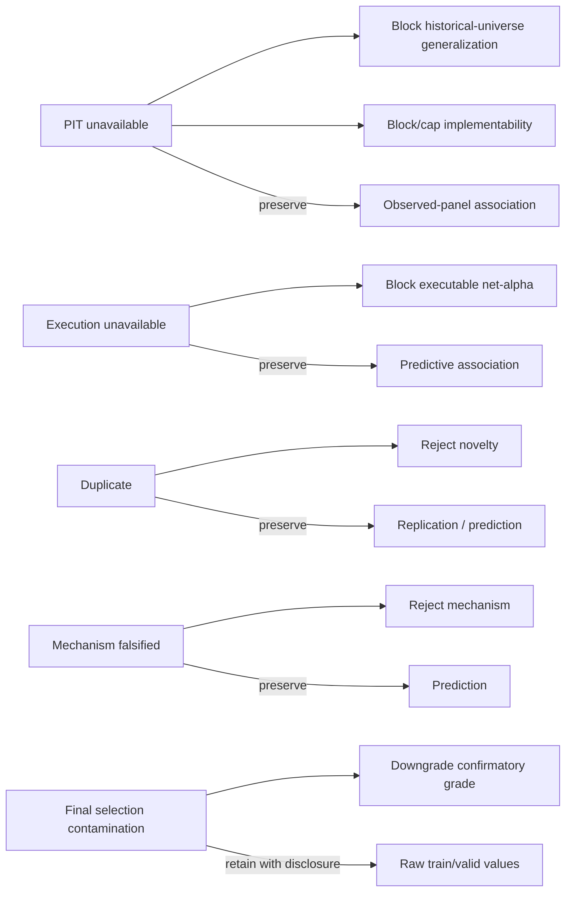

<p align="center">
  <a href="README.md"><b>English</b></a> ·
  <a href="README_zh.md">中文</a>
</p>

<p align="center">
  
</p>

<h1 align="center">Vibe-Trading AGS</h1>

<p align="center">
  <strong>Evidence-governed alpha discovery and production-evaluation research system</strong>
</p>

<p align="center">
  <a href="https://github.com/HKUDS/Vibe-Trading">
    
  </a>
  
  
  
  
  <a href="LICENSE">
    
  </a>
</p>

> [!IMPORTANT]
> **AGS is a production-grade research-evaluation system—not a profitable-alpha claim and not a live-trading authorization layer.**
>
> The v3.1 discovery foundation and the v3.2 Phase 1–11 production-evaluation path are implemented and audited. The accepted empirical status remains deliberately narrower: the flagship baseline is `research_only`; formal Retriever Activation is `inconclusive`; official search remains `flat_with_topology_shadow`; active topology influence is disabled.

<p align="center">
  <a href="#three-minute-overview">Three-minute overview</a> ·
  <a href="#what-i-built">What I built</a> ·
  <a href="#architecture">Architecture</a> ·
  <a href="#verified-results">Verified results</a> ·
  <a href="#evidence-index">Evidence</a> ·
  <a href="docs/AGS_TECHNICAL_OVERVIEW.md">Technical overview</a>
</p>

---

## Three-minute overview

[Vibe-Trading](https://github.com/HKUDS/Vibe-Trading) already provides a finance agent, market-data loaders, backtests, an Alpha Zoo, skills, swarms, and CLI/Web/MCP interfaces.

**Vibe-Trading AGS (Alpha Genesis System)** adds an institution-style research layer that makes factor claims harder to fake, cherry-pick, leak, or silently rewrite.

It answers four questions:

1. Can a factor be generated without arbitrary code execution or hidden test access?
2. Can prediction, PIT generalization, implementability, novelty, mechanism, and portfolio value be evaluated separately?
3. Can every important conclusion be rebuilt from exact source events and content-addressed artifacts instead of caller-supplied scores?
4. Can a new retrieval policy remain inactive until a preregistered, source-complete experiment passes statistical, safety, failure, diversity, and resource gates?

```text
Alpha Zoo / mechanism seed
→ bounded DSL generation
→ canonical factor identity
→ PIT snapshot + frozen evaluation contract
→ observed-panel and PIT-scoped predictive evidence
→ stateful A-share execution
→ identity / complement / mechanism evidence
→ Claim Matrix
→ narrow non-compensatory decision
→ terminal / run / candidate dossiers
→ final / falsification / forward authorities
→ preregistered Flat-vs-Topology Activation
```


### What this repository proves

| Area | Demonstrated capability |
|---|---|
| **Quant research** | Multi-horizon IC, split isolation, dependence-aware inference, A-share execution, novelty, residual prediction, portfolio marginal value, falsification, and forward monitoring |
| **Agent engineering** | Canonical identity, typed lifecycle, Factor DAG, process memory, topology retrieval, protected producers, and deterministic replay |
| **Data engineering** | Tushare/BaoStock PIT adapters, daily membership, availability semantics, security master, corporate actions, partition manifests, and exact raw replay |
| **Scientific design** | Preregistration, research-family identity, multiplicity, SESOI, one-shot final access, contamination taxonomy, non-inferiority, and paired Activation |
| **Reliability/security** | Append-only SQLite WAL, idempotency, concurrency, atomic content-addressed artifacts, redaction/path defenses, parent-enforced timeout/RSS, and GET-only APIs |
| **Research communication** | Trial-, run-, and candidate-level dossiers plus five deterministic audience views |

---

## Upstream platform vs. AGS contribution

| Layer | Origin | Role |
|---|---|---|
| Finance agent, CLI, Web, MCP, skills, swarms | Upstream Vibe-Trading | General interaction and finance workflows |
| Market data, backtests, Alpha Zoo | Upstream Vibe-Trading | Base data and factor inventory |
| Scorecards, Trial Ledger, safe DSL Foundry | **AGS v3.1** | Reproducible factor generation and first-line evidence |
| Novelty, residual prediction, synergy, adversarial decisions | **AGS v3.1** | Rejects beautiful fake alpha and values portfolio contribution |
| Frozen forward tracking, reports, GET-only API | **AGS v3.1** | Append-only monitoring and safe evidence delivery |
| Typed event spine, canonical identity, DAG, process memory | **AGS v3.2** | Source-bound and replayable research history |
| PIT authority, resolved contracts, evaluator, A-share execution | **AGS v3.2** | Complete pre-final production evaluation |
| Claim Matrix, dossiers, Final/Falsification/Forward authority | **AGS v3.2** | Claim-level truth and controlled high-authority access |
| Deterministic evaluator DAG and formal Activation | **AGS v3.2** | Scalable execution and causal testing of retrieval policy |

> General Vibe-Trading installation, providers, skills, swarms, MCP, and broker documentation remain upstream responsibilities. This README focuses on the AGS contribution.

---

## Why ordinary factor mining is not enough

A high backtest IC can still be invalid when:

- the formula reads future data or assumes same-bar execution;
- the historical universe is reconstructed from current survivors;
- train, validation, and final-test boundaries are porous;
- failed or abandoned trials disappear;
- one winner is selected from hundreds of attempts without multiplicity accounting;
- the candidate duplicates a public or existing factor;
- turnover, T+1, suspension, price limits, unavailable holdings, and exit costs erase the signal;
- callers can submit metrics, warnings, or verdicts;
- reports become an unaudited second source of truth;
- final data can be reopened under a new variant identity;
- forward revisions overwrite what was originally observed;
- an experimental Retriever changes official search before causal evidence is complete.

AGS treats these as architecture defects rather than footnotes.

---

## What I built

## AGS v3.1 — Discovery and adversarial quality control

v3.1 established a current-main-compatible, feature-flagged factor-research foundation:

- **Multi-horizon scorecards:** explicit 1/5/10/20-day horizons, positive execution lag, HAC/Newey-West support, split-specific metrics, coverage, decay, and regime diagnostics.
- **A-share research semantics:** ST, suspension, price-limit, new-listing, and liquidity masks; turnover, cost, capacity, and portfolio-style execution returns.
- **Append-only research history:** SQLite WAL Trial Ledger, hash chaining, concurrent append protection, failed/skipped/error trial recording, and redacted Data Snapshot manifests.
- **Safe Alpha Foundry:** bounded AST grammar, mechanism-aware mutations, operator/field/lag/window/depth limits, and no `eval`, `exec`, shell, dynamic import, or untrusted query execution.
- **Mechanism-first mining:** liquidity-conditioned reversal variants with neutralization, smoothing, interaction, duplicate, future, and noise controls.
- **Novelty and portfolio value:** canonical and statistical duplicate checks, date-wise residualization, frozen comparison pools, crowding diagnostics, and marginal portfolio IR/drawdown/turnover.
- **Deterministic quality decisions:** exact hard-failure/advisory codes, evidence caps, caller-override rejection, and honest PBO/DSR naming.
- **Frozen forward tracking:** immutable factor/config identity, append-only observations, monotonic dates, hash chain, and deterministic kill rules.
- **Safe delivery:** redacted reports, CLI rendering, GET-only API, strict schemas, traversal/symlink/NUL defenses, frontend export redaction, static analysis, dependency audit, secret scanning, and deterministic demos.

A high-quality factor is defined as predictive, robust, novel, tradable, portfolio-useful, explainable, reproducible, and forward-testable—not merely high-IC.

## AGS v3.2 — Production evaluation and claim authority

v3.2 changes the trust model:

```text
caller submits exact registered references
→ producer reopens source artifacts
→ computation is rebuilt under a frozen contract
→ protected events bind source, policy, order, and result
→ claim-level assessments are minted
→ a narrow authority issues the decision
```

### Completed phase ledger

| Phase | Merge | Outcome |
|---|---:|---|
| PIT prerequisite | accepted pre-Phase 1 | Registered Tushare/BaoStock adapters, PIT snapshots, source manifests, field availability |
| **1 — Profile / contract / research family** | `eda9a862` | Build-time profile registry, exact resolved contract, applicability, stable research-family identity |
| **2 — Dual predictive evidence** | `c07c5d25` | Observed-panel descriptive evidence separated from PIT-scoped evidence |
| **3 — Serial production evaluator** | `4558aa4d` | Refs-only `ProductionCandidateEvaluatorV1`, fixed-order nodes, exact terminal lifecycle |
| **4 — Stateful A-share execution** | `9f1dd527` | T+1, holdings/trades, price-limit and suspension states, costs, missing-return scenarios |
| **5 — Secondary evidence** | `d2966329` | Producer-bound identity, residual, complement, mechanism, and applicability |
| **6 — Claim Matrix / narrow Decision** | `621763c9` | Orthogonal claims, all-trial selection assessment, non-compensatory Decision v4 |
| **7 — Dossiers / audience views** | `6c8ecba4` | Candidate dossier, run report, release manifest, and five deterministic views |
| **8 — Replayable baseline** | `d325a65a` | Research-only reversal baseline, effective sample 21, 34 events, zero final/forward access |
| **9 — Deterministic evaluator DAG** | `c87b042c` | Spawn scheduler with parent-controlled timeout/RSS; serial evaluator remains authority |
| **10A — Final authority v2** | `b2a5c846` | Research-family one-shot access, raw partitions, dependence-aware recomputation |
| **10B — Falsification authority v2** | `98e7d34c` | Closed test catalog/specs, multiplicity, SESOI, negative controls, TOST/equivalence |
| **10C — Forward authority v3** | `26ddcfd7` | Current-decision eligibility, untainted final, no backfill, vintage-preserving revisions |
| **11 — Formal Retriever Activation** | `2d8ddb56` | Isolated arms, frozen paired schedules, formal protocol, fail-closed inconclusive verdict |

The later hardening path adds a BaoStock research-only input freezer, exact raw-partition replay, and an outcome orchestration path that reuses the existing evaluator, Retriever, Decision services, event store, and artifact system.

---

## Architecture

### End-to-end system



### Evidence Producer DAG

The serial evaluator defines reference semantics. Parallel execution cannot create a second truth.



### Claim Constraint Graph

Evidence gaps constrain only the claims they actually affect.



---

## Research authority model

### Fail-closed promotion, fail-soft analysis

```text
Promotion = strict intersection of authoritative claims required by the target tier
Research Dossier = union of all legally available evidence at the exact watermark
```

Missing evidence cannot become a pass, cannot cross a tier, and cannot erase independent valid analysis. It must resolve into an explicit typed state and terminal artifact.

### Five required bindings

```text
content-bound   stable semantic content and hashes
scope-bound     explicit universe, dates, split, timing, and policy
producer-bound  only registered producers/capabilities may mint evidence
source-bound    every conclusion traces to exact events and artifacts
replay-bound    the result rebuilds from the exact source prefix/partitions
```

### No caller truth

Production entry points may accept identities, exact hashes, registered provider choices, and pre-frozen research scope. They do not accept:

```text
IC / RankIC / return / cost result
score / decision / cap / warning / hard failure
pit_available / survivorship_passed
quality_passed / complementary / supported
precomputed final or falsification series
```

### Reports never decide

```text
Evidence producers → Claim assessments → Decision
                          ↓
                    Canonical Dossier
```

Report JSON, prose, audience views, and LLM summaries cannot mint evidence or change promotion.

---

## Key implementation capabilities

| Capability | Enforced semantics |
|---|---|
| **Canonical factor identity** | AST, grammar, fields, transform, signal/order/entry timing, horizon, universe, and tradability semantics |
| **Typed event spine** | SQLite WAL, append-only hash chain, protected events, idempotency, exact-prefix replay |
| **PIT authority** | Adapter implementation identity, provider vintage, daily membership, field availability, security master, corporate actions, semantic/blob partitions |
| **Dual predictive evidence** | Descriptive observed-panel evidence survives missing PIT; only PIT-scoped evidence can become decision-grade |
| **Stateful A-share execution** | T+1, submitted/filled trades, actual/sellable holdings, blocked notional, costs, unavailable and unpriced exposure |
| **Secondary evidence** | Exact/sign duplicate, residual prediction, frozen comparison pool, portfolio marginal value, mechanism/applicability |
| **Claim Matrix** | Availability, verdict, grade, scope, estimate, uncertainty, bias, selection, blockers, root causes, promotion effect |
| **Narrow Decision** | Protected producer events only, complete trial population, fixed tier invariants, non-compensatory promotion |
| **Three-level dossiers** | Every attempt terminal; every closed run report; qualified candidates receive a canonical dossier |
| **Five audience views** | Research, PM, model risk, executive, and external views derive from one fact layer and retain adverse findings |
| **Serial + DAG evaluation** | Serial evaluator remains authority; spawn workers are bounded by parent timeout/RSS and proven semantically equivalent |
| **Final v2** | Research-family one-shot key, raw partitions, frozen dependence config, SESOI, exact artifact-or-failure terminal |
| **Falsification v2** | Frozen hypotheses/test specs, negative controls, multiplicity, dependence, TOST/equivalence |
| **Forward v3** | Current paper-candidate and untainted final, producer metrics, strictly increasing dates, no backfill, original/restated vintages |
| **Activation** | Frozen paired schedule, counterbalancing, isolated arms, source/resource evidence, preregistered primary and non-inferiority gates |

For the detailed data contracts, execution state inventory, contamination taxonomy, dossier schemas, and authority implementations, see [Technical Overview](docs/AGS_TECHNICAL_OVERVIEW.md).

---

## Verified results

### Replayable flagship baseline

| Field | Recorded value |
|---|---|
| Formula | `neg(delta(close,5))` |
| Status / decision | `COMPLETED_RESEARCH_ONLY` / `research_only` |
| Authority grade | `external_unverified_bundled_historical_fixture` |
| Dates / symbols | 72 / 8 |
| Effective sample | 21 |
| Typed events | 34 |
| Signal / entry | `close_t` / `open_t_plus_1` |
| Horizon / rebalance | 5 / 5 |
| Chain verified | true |
| Serial retry equal | true |
| Final-test access | 0 |
| Forward observations | 0 |
| Candidate dossier / run report | generated / generated |

This baseline proves pipeline execution, exact replay, split isolation, and honest reporting—not profitability.

### Formal Retriever Activation

| Item | Recorded state |
|---|---|
| Infrastructure dry-run groups / arms | 2 / 4 |
| Frozen exploratory pilot pairs | 12 |
| Counterbalancing | 6 Flat-first / 6 Topology-first |
| Complete pilot pairs | 0 |
| Complete confirmatory pairs | 0 |
| Fabricated outcomes | 0 |
| Verdict | `inconclusive` |
| Official policy | `flat_with_topology_shadow` |
| Active topology influence | false |

The system safely stops when authority or inputs are insufficient instead of manufacturing uplift.

### Integrated validation record

```text
Phase 11 protocol / red-team                         8 passed
Focused current + legacy Activation authority      60 passed
Alpha Foundry                                      273 passed
Alpha Quality + Research Ledger                    613 passed
Contracts / security / acceptance / performance     95 passed
Ruff                                                passed
Strict mypy                                         passed
pip check                                           no broken requirements
```

The integrated audit covers 45 cross-layer invariants, including feature-off identity, chain concurrency, exactly-one terminal, canonical factor identity, DAG and process-memory boundaries, Retriever shadow non-interference, final/forward isolation, falsification ordering, equivalence and multiplicity, dependence-aware inference, non-compensatory decisions, one-shot final access, frozen forward monitoring, GET-only APIs, resource budgets, and rollback safety.

A known release-manifest mismatch caused by the user-owned repository-root `problem.md` is recorded rather than hidden.

---

## Adversarial proof scenarios

| Scenario | Expected behavior | Failure exposed |
|---|---|---|
| `future_leak_trap` | Reject | Future field or invalid lag |
| `cherry_picked_noise_trap` | Warn/cap | Winner selected from a large trial family |
| `survivorship_bias_trap` | Research-only cap | Static or survivor-biased universe |
| `high_turnover_cost_trap` | Reject | Costs erase raw alpha |
| `duplicate_public_alpha_trap` | Reject novelty | Existing factor replicated |
| `orthogonal_liquidity_reversal_candidate` | Preserve narrowly | Moderate standalone signal, positive marginal value |
| `forward_decay_kill` | Kill frozen plan | Persistent forward decay |
| Caller score/decision override | Reject | Hand-authored truth |
| Cross-run/trial source mixing | Reject | Evidence identity confusion |
| Artifact/path/blob mismatch | Reject | Tampered or noncanonical evidence |
| Missing PIT with valid observed panel | Preserve descriptive claim, block promotion | Gap must not erase independent analysis |
| Mechanism falsification | Reject mechanism only | One claim must not rewrite another |

---

## Repository map

```text
agent/
├── src/
│   ├── alpha_foundry/
│   │   ├── dsl/                 # Safe grammar and canonical identity
│   │   ├── dag/                 # Factor lineage
│   │   ├── memory/              # Factual / episodic process memory
│   │   ├── retrieval/           # Retriever v7 and shadow policy
│   │   ├── activation/          # Pairing, protocols, resources, statistics
│   │   └── search_lifecycle.py  # Typed candidate lifecycle
│   │
│   ├── alpha_quality/
│   │   ├── evaluation_contract/ # Profiles, contract, applicability, family
│   │   ├── adapters/            # Tushare / BaoStock PIT
│   │   ├── final_test/          # Final authority v2
│   │   ├── falsification/       # Falsification authority v2
│   │   ├── forward/             # Forward authority v3
│   │   ├── predictive_evidence_v4.py
│   │   ├── execution_evidence_v1.py
│   │   ├── secondary_evidence_v1.py
│   │   ├── claim_decision_v1.py
│   │   ├── production_evaluator_v1.py
│   │   ├── evaluator_dag_v1.py
│   │   └── research_dossier_v1.py
│   │
│   ├── research_ledger/events/  # Typed WAL store and replay
│   └── api/alpha_genesis_routes.py
│
├── scripts/                      # BaoStock freeze and outcome orchestration
├── research_evidence/            # Baseline, Phase 9/10/11, readiness, audits
├── examples/alpha_genesis_demos/
└── tests/
```

---

## Getting started

### Run the base application

```bash
git clone https://github.com/Elfsa-Miranda/Vibe-Trading-AGS.git
cd Vibe-Trading-AGS

python -m venv .venv
source .venv/bin/activate
# Windows PowerShell: .venv\Scripts\Activate.ps1

pip install -e .
cp agent/.env.example agent/.env
# Configure one supported LLM provider

vibe-trading
```

### Inspect the AGS path

```bash
pytest agent/tests/alpha_genesis_demos -q
pytest agent/tests/alpha_foundry agent/tests/alpha_quality agent/tests/research_ledger -q
pytest agent/tests/factors/test_alpha_purity.py agent/tests/factors/test_lookahead.py -q

cat agent/research_evidence/production_evaluation_v32/final_execution_audit.md
cat agent/research_evidence/baseline_v1/baseline_manifest.json
cat agent/research_evidence/activation_phase11/phase11_execution_record.json
```

Windows v3.1 acceptance entry point:

```powershell
powershell -ExecutionPolicy Bypass -File scripts\ags_p0_acceptance.ps1
```

> [!NOTE]
> AGS capabilities default to off and are resolved into immutable flag snapshots. Enabling the master flag does not make incomplete evidence authoritative and does not enable live trading.

---

## Evidence index

| Evidence | Purpose |
|---|---|
| [`docs/AGS_TECHNICAL_OVERVIEW.md`](docs/AGS_TECHNICAL_OVERVIEW.md) | Full architecture, research semantics, authority contracts, and implementation deep dive |
| [`docs/ags-v31-extreme-acceptance-summary.md`](docs/ags-v31-extreme-acceptance-summary.md) | v3.1 security and adversarial acceptance |
| [`docs/ags-v32-problem-resolution.md`](docs/ags-v32-problem-resolution.md) | v3.2 audit and authority-resolution ledger |
| [`agent/research_evidence/production_evaluation_v32/final_execution_audit.md`](agent/research_evidence/production_evaluation_v32/final_execution_audit.md) | Integrated Phase 1–11 execution audit |
| [`agent/research_evidence/baseline_v1/baseline_manifest.json`](agent/research_evidence/baseline_v1/baseline_manifest.json) | Replayable research-only baseline |
| [`agent/research_evidence/evaluator_dag_v1/phase9_execution_record.json`](agent/research_evidence/evaluator_dag_v1/phase9_execution_record.json) | Deterministic evaluator DAG |
| [`agent/research_evidence/final_authority_v2/phase10a_execution_record.json`](agent/research_evidence/final_authority_v2/phase10a_execution_record.json) | Final authority |
| [`agent/research_evidence/falsification_authority_v2/phase10b_execution_record.json`](agent/research_evidence/falsification_authority_v2/phase10b_execution_record.json) | Falsification authority |
| [`agent/research_evidence/forward_authority_v3/phase10c_execution_record.json`](agent/research_evidence/forward_authority_v3/phase10c_execution_record.json) | Forward authority |
| [`agent/research_evidence/activation_phase11/phase11_execution_record.json`](agent/research_evidence/activation_phase11/phase11_execution_record.json) | Formal Activation record |
| [`agent/research_evidence/activation_enablement_v2/activation_readiness_v4.json`](agent/research_evidence/activation_enablement_v2/activation_readiness_v4.json) | Immutable readiness snapshot |
| [`docs/alpha-genesis-known-limitations.md`](docs/alpha-genesis-known-limitations.md) | Explicit limitations |

---

## Remaining evidence milestone

The next high-value result is not another Retriever major version or another architecture layer. It is a fresh formal research cycle with:

1. strict field-level PIT authority for the selected provider;
2. producer-bound real train/validation inputs;
3. source-complete whole-arm resource and replay evidence;
4. a new readiness record with no blockers;
5. completed pilot pairs;
6. a preregistered confirmatory design based on pilot variance;
7. an honest approved, rejected, invalidated, or inconclusive result.

---

## Attribution

This repository is a research fork of [HKUDS/Vibe-Trading](https://github.com/HKUDS/Vibe-Trading).

- General agent, data, backtest, skills, swarms, CLI, Web, MCP, and broker capabilities originate from upstream.
- The AGS v3.1/v3.2 discovery, evidence-authority, production-evaluation, and Activation work documented here are the focus of this fork.
- Upstream documentation remains authoritative for the base platform.

## License

Distributed under the [MIT License](LICENSE). Upstream and third-party components retain their original notices and attribution.
