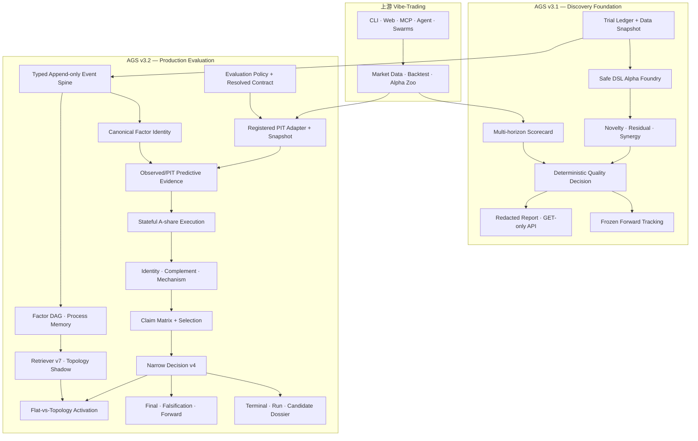
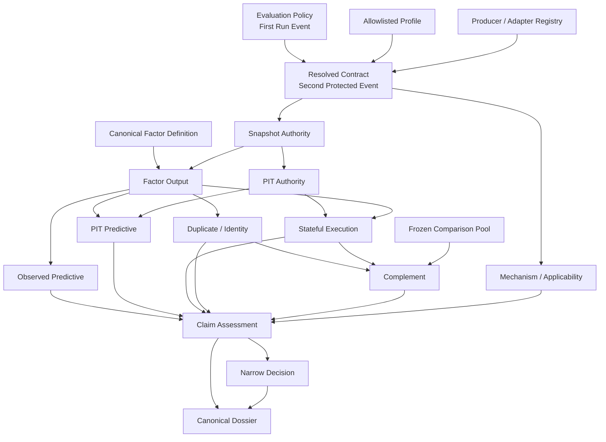
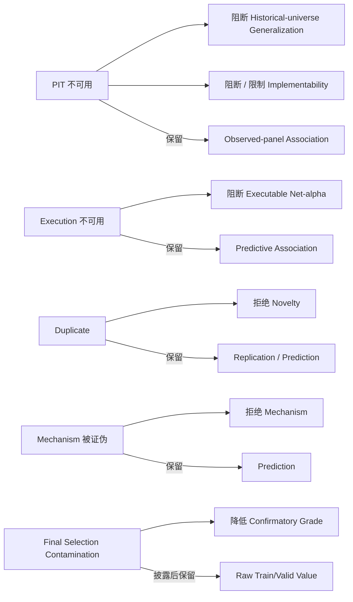

<p align="center">
  <a href="README.md">English</a> ·
  <a href="README_zh.md"><b>中文</b></a>
</p>

<p align="center">
  
</p>

<h1 align="center">Vibe-Trading AGS</h1>

<p align="center">
  <strong>证据治理型 Alpha 发现与生产评估研究系统</strong>
</p>

<p align="center">
  <a href="https://github.com/HKUDS/Vibe-Trading">
    
  </a>
  
  
  
  
  <a href="LICENSE">
    
  </a>
</p>

> [!IMPORTANT]
> **AGS 是一套生产级研究评估系统，不代表已经发现可盈利 Alpha，也不是实时交易授权层。**
>
> v3.1 因子发现基础与 v3.2 Phase 1–11 生产评估链路均已实现并完成审计。当前实证结论仍然刻意保持更窄：旗舰 Baseline 为 `research_only`；Formal Retriever Activation 为 `inconclusive`；官方搜索策略仍是 `flat_with_topology_shadow`；Topology 不会主动影响正式搜索结果。

<p align="center">
  <a href="#三分钟理解项目">三分钟概览</a> ·
  <a href="#我具体完成了什么">完成内容</a> ·
  <a href="#系统架构">系统架构</a> ·
  <a href="#已验证结果">验证结果</a> ·
  <a href="#证据索引">证据索引</a> ·
  <a href="docs/AGS_TECHNICAL_OVERVIEW_zh.md">完整技术说明</a>
</p>

---

## 三分钟理解项目

[Vibe-Trading](https://github.com/HKUDS/Vibe-Trading) 已经提供金融 Agent、市场数据加载、回测、Alpha Zoo、Skills、Swarms，以及 CLI、Web 和 MCP 接口。

**Vibe-Trading AGS（Alpha Genesis System）** 在此基础上增加了一套机构式研究层，让因子结论更难被伪造、挑选、泄漏或事后改写。

它严格回答四个问题：

1. 因子能否在不执行任意代码、不隐藏读取测试集的前提下生成？
2. 系统能否将预测关联、PIT 泛化、可实施性、新颖性、机制和组合价值分别评价？
3. 每项重要结论能否从精确来源事件与内容寻址制品重新计算，而不是相信调用方提交的分数？
4. 新检索策略能否只有在预注册、来源完整的实验通过统计、安全、失败率、多样性与资源门禁后才被激活？

```text
Alpha Zoo / 机制 Seed
→ 有界 DSL 生成
→ 规范因子身份
→ PIT Snapshot + 冻结 Evaluation Contract
→ Observed-panel / PIT-scoped 双通道预测证据
→ A 股状态化执行
→ Identity / Complement / Mechanism Evidence
→ Claim Matrix
→ 窄化、非补偿式 Decision
→ Terminal / Run / Candidate Dossier
→ Final / Falsification / Forward Authority
→ 预注册 Flat-vs-Topology Activation
```

### 当前状态

| 维度 | 状态 |
|---|---|
| AGS v3.1 因子发现与对抗研究基础 | 已实现 |
| AGS v3.2 Phase 1–11 生产评估 | 已集成并审计 |
| 可回放 Pre-final Baseline | 已完成，`research_only` |
| Baseline Effective Sample / Typed Event | 21 / 34 |
| Baseline Final-test Access | 0 |
| Final / Falsification / Forward Authority | 已实现并接受 |
| Formal Activation Infrastructure / Protocol | 已实现 |
| Formal Activation Effectiveness | `inconclusive` |
| Official Search Policy | `flat_with_topology_shadow` |
| Active Topology Influence | false |
| Empirical Profitable-alpha Claim | 尚未建立 |
| Live / Broker / Order Impact | 无 |

### 这个仓库能证明的能力

| 方向 | 已展示能力 |
|---|---|
| **量化研究** | 多周期 IC、Split Isolation、Dependence-aware Inference、A 股执行、新颖性、残差预测、组合边际价值、证伪与 Forward Monitoring |
| **Agent 工程** | Canonical Identity、Typed Lifecycle、Factor DAG、Process Memory、Topology Retrieval、Protected Producer 与 Deterministic Replay |
| **数据工程** | Tushare/BaoStock PIT Adapter、Daily Membership、Availability、Security Master、Corporate Action、Partition Manifest 与 Raw Replay |
| **科学设计** | Preregistration、Research-family Identity、Multiplicity、SESOI、One-shot Final、Contamination Taxonomy、Non-inferiority 与 Paired Activation |
| **可靠性与安全** | Append-only SQLite WAL、Idempotency、Concurrency、Atomic Content-addressed Artifact、Redaction/Path Defense、Parent Timeout/RSS 与 GET-only API |
| **研究表达** | Trial、Run、Candidate 三层 Dossier，以及五类确定性 Audience View |

---

## 上游平台与 AGS 改进边界

| 层级 | 来源 | 作用 |
|---|---|---|
| 金融 Agent、CLI、Web、MCP、Skills、Swarms | 上游 Vibe-Trading | 通用交互与金融工作流 |
| Market Data、Backtest、Alpha Zoo | 上游 Vibe-Trading | 基础数据与因子库存 |
| Scorecard、Trial Ledger、安全 DSL Foundry | **AGS v3.1** | 可复现的因子生成与第一层证据 |
| Novelty、Residual、Synergy、Adversarial Decision | **AGS v3.1** | 拒绝漂亮假 Alpha，并评价组合贡献 |
| Frozen Forward、Report、GET-only API | **AGS v3.1** | Append-only 监控与安全证据交付 |
| Typed Event、Canonical Identity、DAG、Process Memory | **AGS v3.2** | 来源绑定、可回放的研究历史 |
| PIT Authority、Resolved Contract、Evaluator、A 股执行 | **AGS v3.2** | 完整 Pre-final Production Evaluation |
| Claim Matrix、Dossier、Final/Falsification/Forward | **AGS v3.2** | 声明级真值与高权威访问控制 |
| Deterministic DAG / Formal Activation | **AGS v3.2** | 可扩展执行与检索策略因果实验 |

> 通用安装、Provider、Skills、Swarms、MCP 和 Broker 文档仍以上游为权威。本 README 聚焦 AGS 贡献。

---

## 为什么普通因子挖掘远远不够

一个 Backtest IC 很高的因子仍可能完全无效，因为：

- Formula 读取未来数据或假设 Same-bar Execution；
- Historical Universe 由当前 Survivor 倒推；
- Train、Validation、Final-test 边界可被穿透；
- Failed / Abandoned Trial 消失；
- 从数百次尝试中只展示 Winner，却不处理 Multiplicity；
- Candidate 只是 Public / Existing Factor Duplicate；
- Turnover、T+1、Suspension、Price Limit、Unavailable Holding、Exit Cost 抹掉信号；
- Caller 可以直接提交 Metric、Warning 或 Verdict；
- Report 成为第二套未经审计的真值；
- Final Data 可通过 Variant Identity 重新打开；
- Forward Revision 覆盖最初观测；
- Retriever 在因果证据完成前就改变 Official Search。

AGS 将这些视为架构缺陷，而不是脚注。

---

## 我具体完成了什么

## AGS v3.1——因子发现与对抗性质量控制

v3.1 建立了 Current-main Compatible、Feature-flagged 的完整因子研究基础：

- **Multi-horizon Scorecard**：显式 1/5/10/20 日 Horizon、Positive Execution Lag、HAC/Newey-West、Split Metric、Coverage、Decay、Regime。
- **A 股研究语义**：ST、停牌、涨跌停、新股、低流动性 Mask；Turnover、Cost、Capacity、Portfolio-style Execution Return。
- **Append-only Research History**：SQLite WAL Trial Ledger、Hash Chain、Concurrent Append、Failed/Skipped/Error Trial 与脱敏 Data Snapshot。
- **Safe Alpha Foundry**：有界 AST、Mechanism-aware Mutation、Operator/Field/Lag/Window/Depth 限制，不使用 `eval`、`exec`、Shell、Dynamic Import 或不可信 Query。
- **Mechanism-first Mining**：流动性条件化反转、Neutralization、Smoothing、Interaction、Duplicate/Future/Noise Control。
- **Novelty / Portfolio Value**：Canonical / Statistical Duplicate、Date-wise Residual、Frozen Pool、Crowding、Marginal IR/Drawdown/Turnover。
- **Deterministic Quality Decision**：Exact Failure / Advisory Code、Evidence Cap、Caller Override Rejection 与诚实 PBO/DSR 命名。
- **Frozen Forward Tracking**：Immutable Factor / Config、Append-only Observation、Monotonic Date、Hash Chain 与 Deterministic Kill Rule。
- **Safe Delivery**：Redacted Report、CLI、GET-only API、Strict Schema、Traversal/Symlink/NUL Defense、Frontend Redaction、Static Analysis、Dependency/Secret Audit 与 Deterministic Demo。

高质量因子被定义为 Predictive、Robust、Novel、Tradable、Portfolio-useful、Explainable、Reproducible 与 Forward-testable，而不是单纯高 IC。

## AGS v3.2——生产评估与声明权威

v3.2 改变了信任模型：

```text
Caller 提交精确已注册 Ref
→ Producer 重新打开 Source Artifact
→ 在 Frozen Contract 下重算
→ Protected Event 绑定 Source、Policy、Order、Result
→ 生成 Claim-level Assessment
→ Narrow Authority 生成 Decision
```

### 已完成 Phase Ledger

| Phase | Merge | Outcome |
|---|---:|---|
| PIT 前置能力 | Phase 1 前已接受 | Tushare/BaoStock Adapter、PIT Snapshot、Source Manifest、Field Availability |
| **1 — Profile / Contract / Research Family** | `eda9a862` | Build-time Profile、Exact Contract、Applicability、Stable Research Family |
| **2 — Dual Predictive Evidence** | `c07c5d25` | Observed-panel 与 PIT-scoped Evidence 分离 |
| **3 — Serial Production Evaluator** | `4558aa4d` | Refs-only Evaluator、Fixed-order Node、Exact Terminal |
| **4 — Stateful A-share Execution** | `9f1dd527` | T+1、Holdings/Trades、Price-limit/Suspension、Cost、Missing-return |
| **5 — Secondary Evidence** | `d2966329` | Producer-bound Identity、Residual、Complement、Mechanism、Applicability |
| **6 — Claim Matrix / Narrow Decision** | `621763c9` | Orthogonal Claim、All-trial Selection、Non-compensatory Decision v4 |
| **7 — Dossier / Audience View** | `6c8ecba4` | Candidate Dossier、Run Report、Release Manifest、五类 View |
| **8 — Replayable Baseline** | `d325a65a` | Research-only Baseline，Effective Sample 21、34 Event、零 Final/Forward |
| **9 — Deterministic Evaluator DAG** | `c87b042c` | Spawn Scheduler、Parent Timeout/RSS、Serial Authority |
| **10A — Final Authority v2** | `b2a5c846` | Research-family One-shot、Raw Partition、Dependence-aware Recompute |
| **10B — Falsification Authority v2** | `98e7d34c` | Closed Test、Multiplicity、SESOI、Negative Control、TOST |
| **10C — Forward Authority v3** | `26ddcfd7` | Current Decision、Untainted Final、No Backfill、Vintage Revision |
| **11 — Formal Retriever Activation** | `2d8ddb56` | Isolated Arm、Frozen Pair、Formal Protocol、Fail-closed Inconclusive |

后续 Hardening 增加 BaoStock Research-only Input Freezer、Exact Raw-partition Replay 与 Outcome Orchestration，并复用现有 Evaluator、Retriever、Decision、Event Store 和 Artifact System。

---

## 系统架构

### 全链路架构



### Evidence Producer DAG

Serial Evaluator 定义参考语义，Parallel Execution 不能制造第二套真值。



### Claim Constraint Graph

Evidence Gap 只限制其真实影响的 Claim。



---

## Research Authority 模型

### Promotion Fail-closed，Analysis Fail-soft

```text
Promotion = Target Tier 所需 Authoritative Claim 的严格交集
Research Dossier = Exact Watermark 下所有合法 Evidence 的并集
```

缺失证据不能变成 Pass，不能跨越 Tier，也不能抹掉独立有效分析；必须输出显式 Typed State 与 Terminal Artifact。

### 五重权威绑定

```text
content-bound   稳定 Semantic Content / Hash
scope-bound     明确 Universe、Date、Split、Timing、Policy
producer-bound  只有 Registered Producer / Capability 可以 Mint
source-bound    每项结论追溯到 Exact Event / Artifact
replay-bound    从 Exact Source Prefix / Partition 重建
```

### No Caller Truth

Production Entry 可以接受 Identity、Exact Hash、Registered Provider 与 Pre-frozen Scope，但不接受：

```text
IC / RankIC / Return / Cost Result
Score / Decision / Cap / Warning / Hard Failure
pit_available / survivorship_passed
quality_passed / complementary / supported
Precomputed Final / Falsification Series
```

### Report 永不参与 Decision

```text
Evidence Producer → Claim Assessment → Decision
                         ↓
                   Canonical Dossier
```

Report JSON、Prose、Audience View 和 LLM Summary 不能生成 Evidence，也不能改变 Promotion。

---

## 关键实现能力

| Capability | 强制语义 |
|---|---|
| **Canonical Factor Identity** | AST、Grammar、Field、Transform、Signal/Order/Entry Timing、Horizon、Universe、Tradability |
| **Typed Event Spine** | SQLite WAL、Append-only Hash Chain、Protected Event、Idempotency、Exact-prefix Replay |
| **PIT Authority** | Adapter Implementation、Provider Vintage、Daily Membership、Field Availability、Security Master、Corporate Action、Semantic/Blob Partition |
| **Dual Predictive Evidence** | Missing PIT 时保留 Descriptive Observed-panel；只有 PIT-scoped Evidence 可成为 Decision-grade |
| **Stateful A-share Execution** | T+1、Submitted/Filled Trade、Actual/Sellable Holding、Blocked Notional、Cost、Unavailable/Unpriced Exposure |
| **Secondary Evidence** | Exact/Sign Duplicate、Residual、Frozen Pool、Portfolio Marginal Value、Mechanism/Applicability |
| **Claim Matrix** | Availability、Verdict、Grade、Scope、Estimate、Uncertainty、Bias、Selection、Blocker、Root Cause |
| **Narrow Decision** | 只消费 Protected Producer Event、完整 Trial Population、固定 Tier Invariant、Non-compensatory |
| **三层 Dossier** | Every Attempt Terminal、Every Closed Run Report、Qualified Candidate Canonical Dossier |
| **五类 Audience View** | Research、PM、Model Risk、Executive、External 共用 Fact Layer 并保留 Adverse Finding |
| **Serial + DAG** | Serial 保持 Authority；Spawn Worker 由 Parent 控制 Timeout/RSS，并证明语义等价 |
| **Final v2** | Research-family One-shot、Raw Partition、Frozen Dependence、SESOI、Exact Artifact-or-failure |
| **Falsification v2** | Frozen Hypothesis/Test、Negative Control、Multiplicity、Dependence、TOST/Equivalence |
| **Forward v3** | Current Paper Candidate、Untainted Final、Producer Metric、Strict Date、No Backfill、Original/Restated Vintage |
| **Activation** | Frozen Pair、Counterbalance、Isolated Arm、Source/Resource Evidence、Preregistered Primary/NI Gate |

完整 Data Contract、Execution State、Contamination Taxonomy、Dossier Schema 与 Authority 细节见 [完整技术说明](docs/AGS_TECHNICAL_OVERVIEW_zh.md)。

---

## 已验证结果

### 可回放旗舰 Baseline

| 字段 | 记录值 |
|---|---|
| Formula | `neg(delta(close,5))` |
| Status / Decision | `COMPLETED_RESEARCH_ONLY` / `research_only` |
| Authority Grade | `external_unverified_bundled_historical_fixture` |
| Date / Symbol | 72 / 8 |
| Effective Sample | 21 |
| Typed Event | 34 |
| Signal / Entry | `close_t` / `open_t_plus_1` |
| Horizon / Rebalance | 5 / 5 |
| Chain Verified | true |
| Serial Retry Equal | true |
| Final-test Access | 0 |
| Forward Observation | 0 |
| Candidate Dossier / Run Report | 已生成 / 已生成 |

这个 Baseline 证明的是 Pipeline Execution、Exact Replay、Split Isolation 与 Honest Reporting，而不是盈利能力。

### Formal Retriever Activation

| 项目 | 记录状态 |
|---|---|
| Infrastructure Dry-run Group / Arm | 2 / 4 |
| Frozen Exploratory Pilot Pair | 12 |
| Counterbalance | 6 Flat-first / 6 Topology-first |
| Complete Pilot Pair | 0 |
| Complete Confirmatory Pair | 0 |
| Fabricated Outcome | 0 |
| Verdict | `inconclusive` |
| Official Policy | `flat_with_topology_shadow` |
| Active Topology Influence | false |

系统在 Authority 或 Input 不足时安全停止，而不是制造 Uplift。

### 集成验证记录

```text
Phase 11 Protocol / Red-team                       8 passed
Current + Legacy Activation Authority            60 passed
Alpha Foundry                                   273 passed
Alpha Quality + Research Ledger                 613 passed
Contracts / Security / Acceptance / Performance 95 passed
Ruff                                              passed
Strict mypy                                       passed
pip check                                         no broken requirements
```

集成审计覆盖 45 项跨层 Invariant，包括 Feature-off Identity、Chain Concurrency、Exactly-one Terminal、Canonical Identity、DAG / Process Memory、Retriever Shadow、Final/Forward Isolation、Falsification Ordering、Equivalence / Multiplicity、Dependence-aware Inference、Non-compensatory Decision、One-shot Final、Frozen Forward、GET-only API、Resource Budget 与 Rollback Safety。

一个由用户持有的根目录 `problem.md` 导致的 Release-manifest Known Mismatch 被明确记录，而不是隐藏。

---

## 对抗性证明场景

| 场景 | 预期行为 | 暴露问题 |
|---|---|---|
| `future_leak_trap` | Reject | Future Field / Invalid Lag |
| `cherry_picked_noise_trap` | Warn / Cap | Large Trial Family Winner |
| `survivorship_bias_trap` | Research-only Cap | Static / Survivor-biased Universe |
| `high_turnover_cost_trap` | Reject | Cost 抹掉 Raw Alpha |
| `duplicate_public_alpha_trap` | Reject Novelty | Existing Factor Replication |
| `orthogonal_liquidity_reversal_candidate` | Narrow Preserve | Moderate Signal + Positive Marginal Value |
| `forward_decay_kill` | Kill Frozen Plan | Persistent Forward Decay |
| Caller Score / Decision Override | Reject | Hand-authored Truth |
| Cross-run / Trial Source Mix | Reject | Evidence Identity Confusion |
| Artifact / Path / Blob Mismatch | Reject | Tampered Evidence |
| Missing PIT + Valid Observed Panel | 保留描述 Claim、阻断晋级 | Gap 不应抹掉独立分析 |
| Mechanism Falsification | 只拒绝 Mechanism | Claim 不应互相改写 |

---

## 仓库结构

```text
agent/
├── src/
│   ├── alpha_foundry/
│   │   ├── dsl/                 # Safe Grammar / Canonical Identity
│   │   ├── dag/                 # Factor Lineage
│   │   ├── memory/              # Factual / Episodic Memory
│   │   ├── retrieval/           # Retriever v7 / Shadow
│   │   ├── activation/          # Pair / Protocol / Resource / Statistics
│   │   └── search_lifecycle.py  # Typed Candidate Lifecycle
│   │
│   ├── alpha_quality/
│   │   ├── evaluation_contract/ # Profile / Contract / Applicability / Family
│   │   ├── adapters/            # Tushare / BaoStock PIT
│   │   ├── final_test/          # Final Authority v2
│   │   ├── falsification/       # Falsification Authority v2
│   │   ├── forward/             # Forward Authority v3
│   │   ├── predictive_evidence_v4.py
│   │   ├── execution_evidence_v1.py
│   │   ├── secondary_evidence_v1.py
│   │   ├── claim_decision_v1.py
│   │   ├── production_evaluator_v1.py
│   │   ├── evaluator_dag_v1.py
│   │   └── research_dossier_v1.py
│   │
│   ├── research_ledger/events/  # Typed WAL / Replay
│   └── api/alpha_genesis_routes.py
│
├── scripts/                      # BaoStock Freeze / Outcome Orchestration
├── research_evidence/            # Baseline、Phase 9/10/11、Readiness、Audit
├── examples/alpha_genesis_demos/
└── tests/
```

---

## 快速开始

### 运行基础 Vibe-Trading

```bash
git clone https://github.com/Elfsa-Miranda/Vibe-Trading-AGS.git
cd Vibe-Trading-AGS

python -m venv .venv
source .venv/bin/activate
# Windows PowerShell：.venv\Scripts\Activate.ps1

pip install -e .
cp agent/.env.example agent/.env
# 配置一个受支持的 LLM Provider

vibe-trading
```

### 检查 AGS Path

```bash
pytest agent/tests/alpha_genesis_demos -q
pytest agent/tests/alpha_foundry agent/tests/alpha_quality agent/tests/research_ledger -q
pytest agent/tests/factors/test_alpha_purity.py agent/tests/factors/test_lookahead.py -q

cat agent/research_evidence/production_evaluation_v32/final_execution_audit.md
cat agent/research_evidence/baseline_v1/baseline_manifest.json
cat agent/research_evidence/activation_phase11/phase11_execution_record.json
```

Windows v3.1 Acceptance：

```powershell
powershell -ExecutionPolicy Bypass -File scripts\ags_p0_acceptance.ps1
```

> [!NOTE]
> AGS Capability 默认关闭，并解析为 Immutable Flag Snapshot。开启 Master Flag 不会让不完整证据自动获得 Authority，也不会启用 Live Trading。

---

## 证据索引

| Evidence | 作用 |
|---|---|
| [`docs/AGS_TECHNICAL_OVERVIEW_zh.md`](docs/AGS_TECHNICAL_OVERVIEW_zh.md) | 完整架构、研究语义、Authority Contract 与实现细节 |
| [`docs/ags-v31-extreme-acceptance-summary.md`](docs/ags-v31-extreme-acceptance-summary.md) | v3.1 Security / Adversarial Acceptance |
| [`docs/ags-v32-problem-resolution.md`](docs/ags-v32-problem-resolution.md) | v3.2 Audit / Authority Resolution |
| [`agent/research_evidence/production_evaluation_v32/final_execution_audit.md`](agent/research_evidence/production_evaluation_v32/final_execution_audit.md) | Phase 1–11 集成执行审计 |
| [`agent/research_evidence/baseline_v1/baseline_manifest.json`](agent/research_evidence/baseline_v1/baseline_manifest.json) | Replayable Research-only Baseline |
| [`agent/research_evidence/evaluator_dag_v1/phase9_execution_record.json`](agent/research_evidence/evaluator_dag_v1/phase9_execution_record.json) | Deterministic Evaluator DAG |
| [`agent/research_evidence/final_authority_v2/phase10a_execution_record.json`](agent/research_evidence/final_authority_v2/phase10a_execution_record.json) | Final Authority |
| [`agent/research_evidence/falsification_authority_v2/phase10b_execution_record.json`](agent/research_evidence/falsification_authority_v2/phase10b_execution_record.json) | Falsification Authority |
| [`agent/research_evidence/forward_authority_v3/phase10c_execution_record.json`](agent/research_evidence/forward_authority_v3/phase10c_execution_record.json) | Forward Authority |
| [`agent/research_evidence/activation_phase11/phase11_execution_record.json`](agent/research_evidence/activation_phase11/phase11_execution_record.json) | Formal Activation Record |
| [`agent/research_evidence/activation_enablement_v2/activation_readiness_v4.json`](agent/research_evidence/activation_enablement_v2/activation_readiness_v4.json) | Immutable Readiness Snapshot |
| [`docs/alpha-genesis-known-limitations.md`](docs/alpha-genesis-known-limitations.md) | 显式 Limitation |

---

## 下一项 Evidence Milestone

下一步最有含金量的结果不是 Retriever v8/v9，也不是再堆一层架构，而是一个新的 Formal Research Cycle：

1. 对选定 Provider 建立严格 Field-level PIT Authority；
2. 提供 Producer-bound Real Train / Validation Input；
3. 形成 Source-complete Whole-arm Resource / Replay Evidence；
4. 生成没有 Blocker 的新 Readiness Record；
5. 完成 Pilot Pair；
6. 按 Pilot Variance 预注册 Confirmatory Design；
7. 诚实输出 Approved、Rejected、Invalidated 或 Inconclusive。

---

## 归属与致谢

本仓库是 [HKUDS/Vibe-Trading](https://github.com/HKUDS/Vibe-Trading) 的研究型 Fork。

- 通用 Agent、Data、Backtest、Skills、Swarms、CLI、Web、MCP 与 Broker 能力来自上游。
- 本 Fork 的重点是本文所描述的 AGS v3.1/v3.2 Discovery、Evidence Authority、Production Evaluation 与 Activation。
- 基础平台文档以上游为权威。

## 许可证

本项目采用 [MIT License](LICENSE)。上游与第三方组件保留原始声明与归属。
